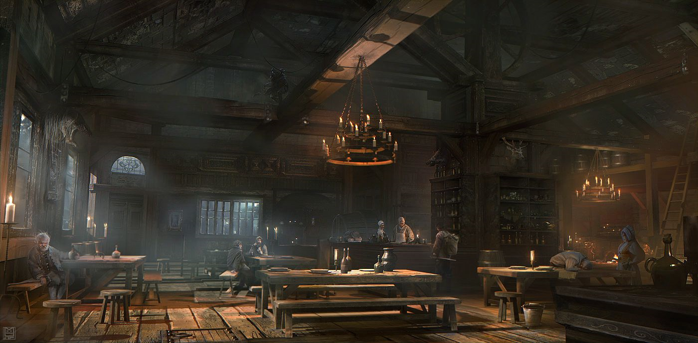
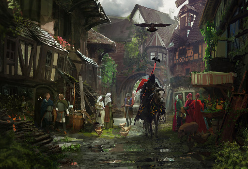

#Lugares de Referencia

## Taberna del Gran Miracles

El renombrado aventurero Miracles erigió esta taberna desde los cimientos para brindar un refugio a otros viajeros, un lugar donde pudieran descansar, intercambiar historias y realizar transacciones comerciales. Con el tiempo, esta taberna se ha convertido en mucho más que un simple establecimiento, transformándose en un verdadero ícono gastronómico. Bajo la visión del arquitecto Miracles, se han llevado a cabo expansiones impresionantes, incluyendo la conexión de la taberna con el enigmático "paso místico".

{ align=left } El Paso Místico es un vibrante epicentro de comercio y entretenimiento que atrae a visitantes de diversas partes del cosmos. Tener la oportunidad de explorar este lugar y participar en intercambios es considerado un privilegio invaluable. El Paso Místico alberga una asombrosa variedad de tesoros, incluyendo información valiosa, objetos únicos, hechizos y artefactos mágicos, así como servicios especializados.

Cabe destacar que todas las entregas se realizan exclusivamente en los puntos de recolección designados, y para acceder a estos beneficios de entrega es necesario disponer de una casilla postal personal. Es importante destacar que el uso de armas u objetos mágicos está estrictamente prohibido tanto en la taberna como en el Paso Místico. Este riguroso reglamento es una medida de seguridad para evitar recordar los trágicos sucesos del fatídico "Día del Ajuste de Cuentas".

### Objetos Permitidos

Como es bien sabido, los conflictos violentos, los asesinatos y la posesión de objetos mágicos y armas están estrictamente prohibidos en la taberna y sus instalaciones. Se cuenta que la formidable magia del gran Miracles hace imposible eludir esta seguridad, y muchos han intentado desafiarla sin éxito, encontrando un trágico destino.

Solo se permiten los siguientes objetos dentro de la taberna:

* `Ropas` - Toda prenda no magica, de cualquier tipo y que no proporcione defensas.
* `Animales` - Solo animales mundanos, no compañeros o invocaciones druidicas.
* `Mochilas` - Solo bolsos normales, no de contencion.
* `Documentos` - No se permite el acceso a papiros de conjuros o similares.
* `Antorchas` - Fuego mundano.
* `Cocina` - Se permite comida o raciones de viaje, condimentos y utensilios de cocina.
* `Cuerdas` - Cuerdas no magicas.
* `Kit de sanacion` - Los kit de sanación de aventurero estan permitidos.
* `Catalejos` - Items para ver cosas espelusnantes de cerca estan permitidos.
* `Espejos` - Solo para admirar belleza.
* `Pack Aventurero` - Todo lo que haga daño o pueda usarse como arma estara prohibido.

### Concurso Gastronomico Cósmico

Cada cierto tiempo se reunen cocineros de todos los rincones del cosmos para competir. Los Cheffs poseen privilegios unicos dentro de este establecimiento, tener una licencia de cocina es algo importante acá.

